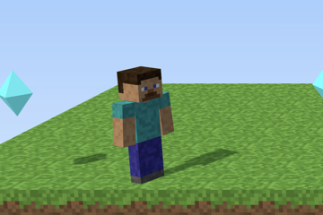
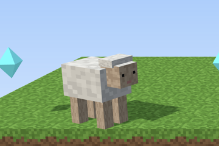
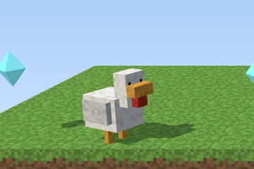
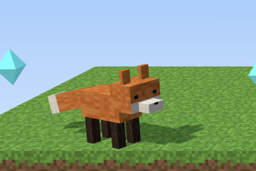
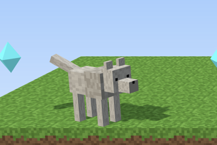
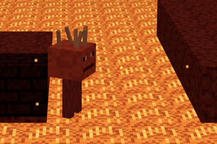
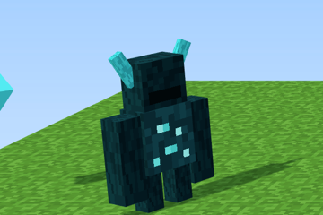

# Steves Pixel Sprint

**Ein Fan-Jump-'n'-Run für Minecraft-Fans**

> **NOT AN OFFICIAL MINECRAFT PRODUCT. NOT APPROVED BY OR ASSOCIATED WITH MOJANG OR MICROSOFT.**
>
> Kein offizielles Minecraft-Produkt, nicht von Mojang oder Microsoft genehmigt und nicht mit ihnen verbunden. Minecraft ist eine Marke von Mojang Synergies AB.
> Das Spiel ist kostenlos, ohne Werbung und ohne Käufe. Alle Grafiken, Figuren, Sounds und die Musik sind selbst gemacht bzw. werden im Code erzeugt – es werden keine Dateien aus Minecraft verwendet.
> Es folgt den [Minecraft-Nutzungsrichtlinien](https://www.minecraft.net/en-us/usage-guidelines).
> Die Pixel-Schrift „Press Start 2P“ (The Press Start 2P Project Authors) steht unter der SIL Open Font License, siehe `src/fonts/OFL.txt`.
>
> Verantwortlich: Ronny Hartenstein · Kontakt: [Impressum](https://blog.rh-flow.de/impressum/)

Ein 2.5D-Sidescroller im Minecraft-Stil für den Browser, gebaut mit [Three.js](https://threejs.org/).

**Spielen:** https://blog.rh-flow.de/minecraft-jumpnrun/

## Steuerung

| Taste | Aktion |
| --- | --- |
| A / D oder ← / → | Laufen |
| Leertaste, W oder ↑ | Springen (länger halten = höher) |
| R | Level neu starten |
| Esc | Levelauswahl |
| Enter | Nach dem Ziel: nächstes Level |
| M | Ton an/aus |
| N | Musik an/aus (Geräusche bleiben an) |

**Auf Handy und Tablet** (quer oder hochkant): links ◀ ▶ zum Laufen, rechts ⬆ zum Springen, ☰ oben rechts öffnet die Levelauswahl. Zum Ausprobieren am Rechner `?touch` an die Adresse hängen.

**Mit Gamepad** (Xbox, PlayStation, Switch …): Stick oder Steuerkreuz laufen, A springt. In Menüs wählt das Steuerkreuz aus und A bestätigt, Start öffnet die Levelauswahl.

## Level

Sechs Welten mit je drei Leveln. Jede Welt bringt etwas Neues, x-3 ist jeweils das schwerste Level.

| Welt | Neu in dieser Welt | Level |
| --- | --- | --- |
| 1 Wiese | Laufen, Springen, Lücken, Slimes, Creeper | 1-1 Die Wiese · 1-2 Der Wald · 1-3 Das Dorf |
| 2 Wüste | Lava | 2-1 Die Wüste · 2-2 Der Canyon · 2-3 Der Wüstentempel |
| 3 Höhle | Decken, Lavaseen mit Trittsteinen, Fackeln | 3-1 Die Höhle · 3-2 Die Mine · 3-3 Die Diamantenhöhle |
| 4 Schneeberge | Rutschiges Eis, viel Klettern | 4-1 Die Schneeberge · 4-2 Der Eissee · 4-3 Der Gipfel |
| 5 Nether | Seelensand, Lavameer, Magmawürfel | 5-1 Der Nether · 5-2 Das Lavameer · 5-3 Die Netherfestung |
| 6 End | Leere unter den Inseln, Obsidiansäulen, Purpur-Endstadt | 6-1 Das End · 6-2 Die Obsidiansäulen · 6-3 Die Endstadt |

Gegner: Creeper, Slimes (im Nether Magmawürfel), Zombies (in der Wüste Wüstenzombies), Spinnen (in der Höhle Höhlenspinnen), Skelette (im Schnee Eiswanderer) mit Pfeilen, Waldhexen mit Gift, im Nether Lohen mit Feuerbällen und im End Endermen, Shulker und Endermiten. Von oben draufspringen besiegt sie; seitlich berühren oder von einem Geschoss getroffen werden heißt zurück zum Checkpoint. Creeper, Skelette, Lohen und Shulker sind dagegen bei Berührung harmlos, man kommt aber nicht durch sie hindurch. Endermen greifen an, sobald sie Steve sehen, und teleportieren sich ab und zu ein Stück weiter. Kommt man einem Creeper zu nah, blinkt er weiß und explodiert nach 1,5 Sekunden – schnell drüberspringen und weg, oder gleich draufspringen!

In jedem Level liegen 10 Diamanten 💎: manche auf dem Weg, manche für Mutige über Lava und Abgründen.

**Schwierigkeitsgrade:** Jedes Level gibt es auf Leicht, Mittel und Schwer (Auswahl oben in der Levelauswahl). Auf Mittel und Schwer kommen zusätzliche Gegner dazu, Creeper zünden schneller, Slimes hüpfen öfter, die Lava ist weniger gnädig, und auf Schwer gibt es keine Checkpoints. Schwer gibt es für ein Level erst, wenn man es auf Mittel geschafft hat. Alle Werte stehen in `src/game/difficulty.ts`.

Das nächste Level wird freigeschaltet, sobald das vorherige geschafft ist. Bestzeiten und gefundene Diamanten merkt sich der Browser.
Direkt zu einem Level springen: `#level=2-3` an die Adresse anhängen.
Alle Level automatisch prüfen (Regeln und ein Bot, der jedes Level durchspielt): `?pruefen` an die Adresse anhängen.

**Eigene Level bauen:** Die Level sind einfache Textdateien im Ordner `levels/`. Eigene Level kommen nach `levels/eigene/` und erscheinen automatisch im Menü in der Spalte „Eigene“. Die Anleitung mit allen Zeichen steht in [LEVELS.md](LEVELS.md).

## Endlos-Lauf ∞

Neben den Welten gibt es den **Endlos-Lauf**: eine Strecke, die nie aufhört. Sie wird unterwegs Stück für Stück erzeugt, und jedes Stück wird vorher automatisch getestet, ob man es auf Leicht schaffen kann. Nach etwa 300 Blöcken wechselt das Biom – zufällig, auch mal direkt vom Nether auf die Wiese.

- **5 Herzen:** Jeder Treffer, jeder Sturz und jede Lava kostet ein Herz, dann geht es am letzten Checkpoint weiter. Für je 10 Diamanten gibt es ein Herz dazu, bis zu 10 Herzen.
- **Meter:** Gezählt wird, wie weit man kommt. Die Bestweite merkt sich der Browser.
- **Zeitlimit auf Mittel und Schwer:** Auf Mittel startet man mit 90 Sekunden und bekommt alle 300 Blöcke 75 dazu, auf Schwer 60 und 55. Leicht hat keine Uhr.
- **Seed:** Jeder Lauf hat eine 6-stellige Zahl. Gleicher Seed heißt gleiche Strecke – und auf gleicher Schwierigkeit auch dieselben Monster an denselben Stellen. Am Ende kann man den Lauf **wiederholen** oder **neu starten**. Im Menü kann man einen Seed eingeben: So laufen Freunde dieselbe Strecke und vergleichen ihre Meter. Direkt-Link: `#endlos=123456`.

Der Generator steht in `src/endless/`.

## Spielfiguren

Am Anfang spielt man Steve. Wer eine ganze Welt auf **Mittel** schafft, bekommt ein Tier dazu. Die Figur wählt man in der Levelauswahl.
Jedes Tier kann etwas besser als Steve, aber nichts schlechter. So bleibt jedes Level mit jeder Figur schaffbar.

| | | |
| :---: | :---: | :---: |
|  |  |  |
| **🧍 Steve** · von Anfang an | **🐑 Schaf** · Welt 1 auf Mittel | **🐔 Huhn** · Welt 2 auf Mittel |
| Der Klassiker: läuft, springt und kann alles, was man für die Level braucht. | Federt weich: Springt es auf einen Gegner, hüpft es viel höher ab als Steve. Gut, um von Gegner zu Gegner zu springen. | Flattert: Hält man in der Luft die Sprungtaste gedrückt, schlägt es mit den Flügeln und sinkt ganz langsam. Rettet einen über breite Lücken. |
|  |  |  |
| **🦊 Fuchs** · Welt 3 auf Mittel | **🐺 Wolf** · Welt 4 auf Mittel | **🔥 Schreiter** · Welt 5 auf Mittel |
| Flink: läuft schneller als alle anderen. Ideal für die Jagd nach Bestzeiten. | Springt höher: kommt an Diamanten, die für Steve knapp zu hoch hängen. | Hitzefest: läuft über Lava, ohne Schaden zu nehmen. Nur Feuerbälle, Gegner und Abgründe sind noch gefährlich. |
|  | | |
| **💥 Warden** · Welt 6 auf Mittel | | |
| Schallwelle: Landet er nach einem Sprung, sind alle Gegner und Geschosse im Umkreis von 3 Blöcken besiegt. Einfach neben Gegnern hochspringen! | | |

Alle Werte stehen in `src/game/figures.ts`, die Modelle in `src/game/animals.ts`.

## Entwickeln

Node.js läuft im Docker-Container, auf dem Rechner muss nur Docker installiert sein.

```sh
docker compose up
```

Danach läuft das Spiel unter http://localhost:5173/minecraft-jumpnrun/. Änderungen am Code werden sofort neu geladen.

Build prüfen (TypeScript-Check und Produktions-Build):

```sh
docker compose run --rm dev npm run build
```

Jeder Push auf `main` wird automatisch auf GitHub Pages veröffentlicht.

## Aufbau

```
src/
  engine/    Game-Loop, Tastatur
  game/      Szene, Welt, Steve und Tiere, Spieler-Physik, Kamera, Partikel
  ui/        Menü, Hinweise, Ziel-Anzeige
  levels/    Level-Format, Biome, Laden der Level-Dateien
  endless/   Endlos-Lauf: Strecken-Generator, Sprungtest, Nachladen
  textures/  Pixel-Texturen, im Code erzeugt
levels/      Die Level als Textdateien, eigene Level in levels/eigene/
```
